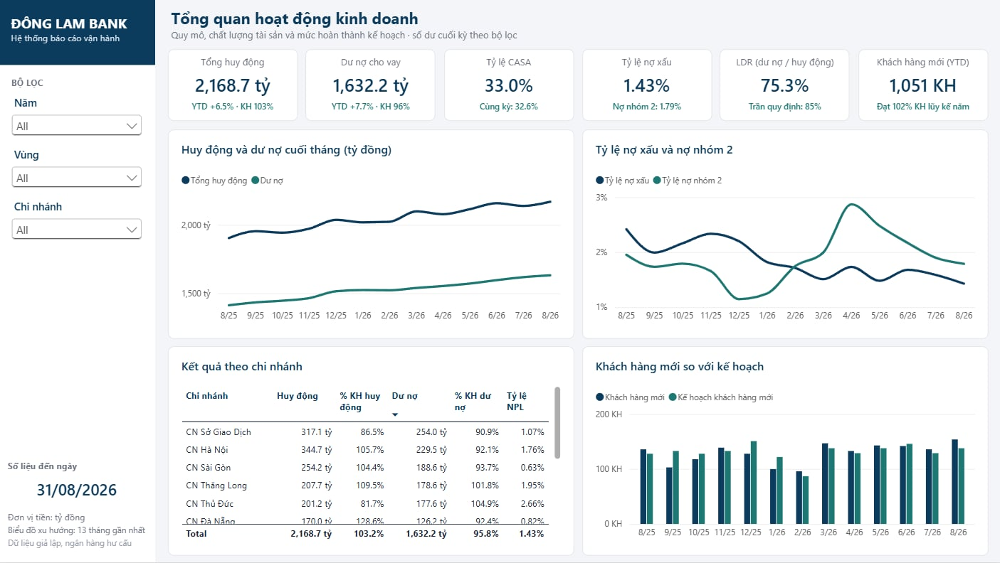
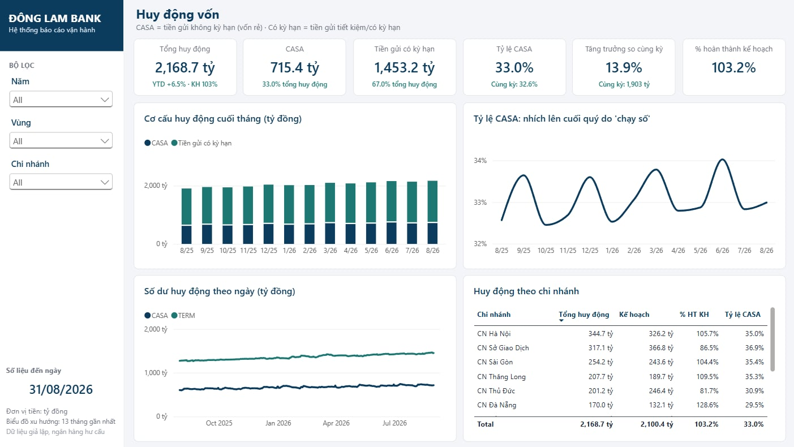
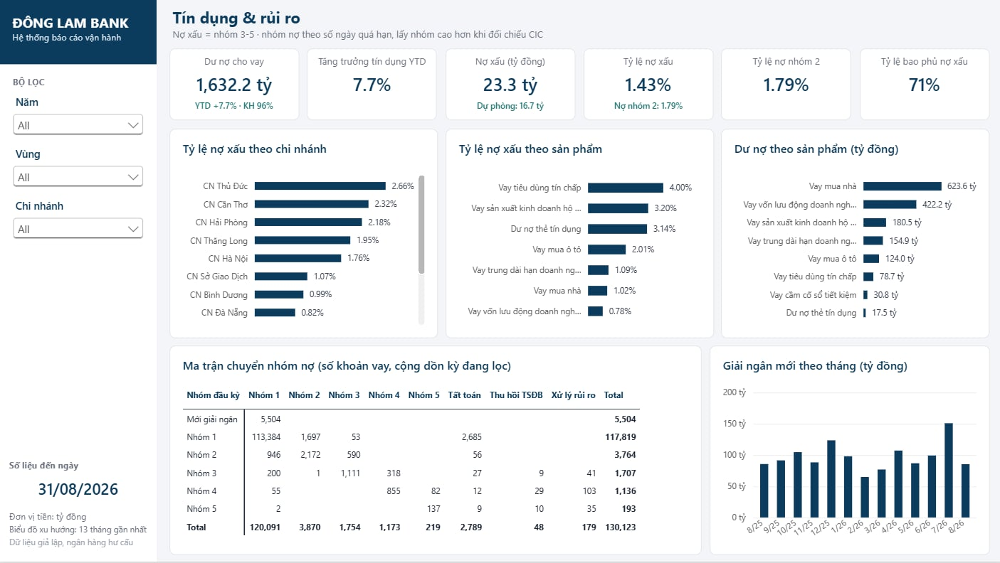
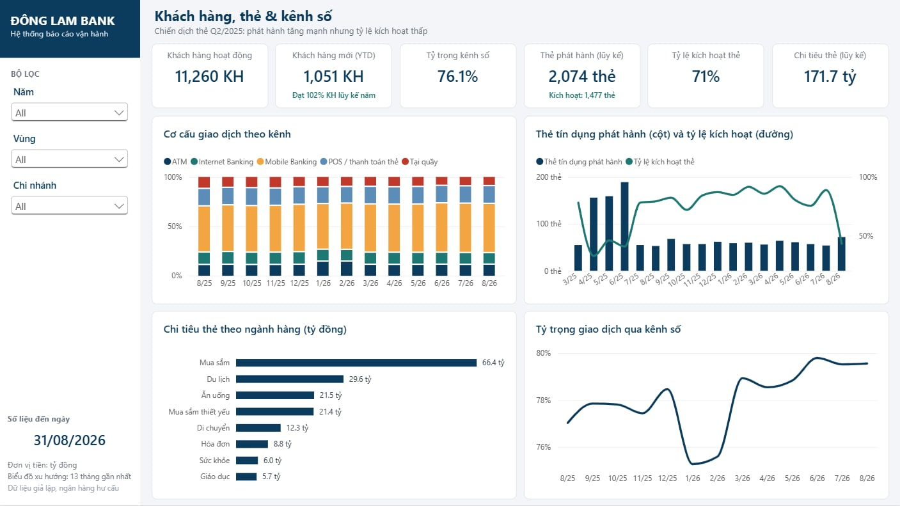
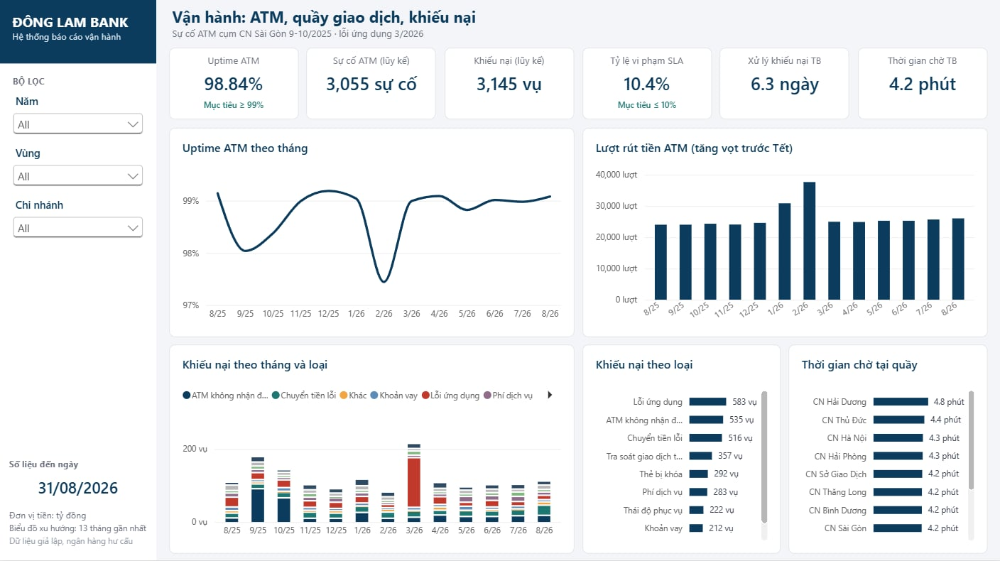
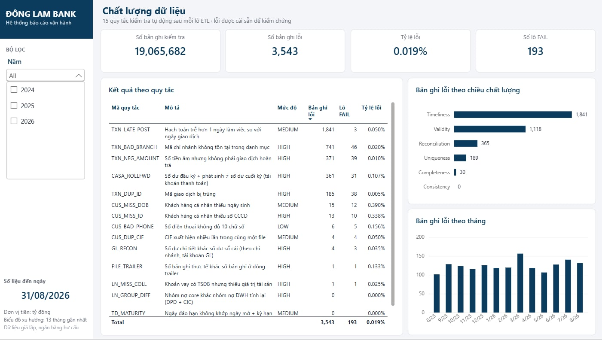

# Bank Operations Reporting

Hệ thống báo cáo vận hành end-to-end cho một **ngân hàng TMCP tư nhân tầm trung, mạnh bán lẻ** tại Việt Nam. Dự án mô phỏng đúng luồng dữ liệu của một ngân hàng thật:

```
Core Banking (mô phỏng) ──EOD──▶ file trích xuất ──Python ETL──▶ PostgreSQL DWH ──▶ Data Mart ──▶ Power BI / Excel
                                 (pipe-delimited,        │           (stg → dwh → mart)
                                  header + trailer)      └── kiểm soát chất lượng dữ liệu (dq)
```

> **Dữ liệu giả lập.** "Ngân hàng TMCP Đông Lam" (mã `DLB`) là tên **hư cấu**. Toàn bộ dữ liệu do `python/generator` sinh ra và được hiệu chỉnh theo số liệu công khai của ngành ngân hàng Việt Nam (xem [docs/02_calibration.md](docs/02_calibration.md)). Không chứa dữ liệu của bất kỳ ngân hàng hay khách hàng thật nào.

## Quy mô dữ liệu

| Hạng mục                 | Giá trị                                                                                             |
| -------------------------- | ----------------------------------------------------------------------------------------------------- |
| Giai đoạn                | 31/12/2023 (migration) → 31/08/2026                                                                  |
| Mạng lưới               | 12 chi nhánh + 28 phòng giao dịch, 61 ATM, theo **34 tỉnh/thành sau sáp nhập 01/07/2025** |
| Khách hàng               | 12.000 cá nhân + 500 doanh nghiệp SME                                                              |
| Giao dịch tài khoản     | ~3,7 triệu                                                                                           |
| Giao dịch thẻ tín dụng | ~250 nghìn                                                                                           |
| Lô dữ liệu              | 33 lô lịch sử (tháng) + 21 lô EOD (ngày làm việc tháng 08/2026)                              |

## Công cụ

| Công cụ            | Vai trò                                                                                                            |
| -------------------- | ------------------------------------------------------------------------------------------------------------------- |
| **Python**     | Mô phỏng core banking, ETL, kiểm thử (pytest), tự động hóa                                                  |
| **PostgreSQL** | Data warehouse: staging → dimension/fact (SCD2, partition) → mart; stored procedure xử lý lô, đối chiếu, DQ |
| **Excel**      | Kế hoạch kinh doanh (giả định, phân bổ chi nhánh, công thức) được ETL nạp vào DWH                    |
| **Power BI**   | Dashboard điều hành, huy động, tín dụng, thẻ & kênh số, vận hành, chất lượng dữ liệu               |

## Chạy nhanh

Dữ liệu đầy đủ đã có sẵn trong repo ở dạng nén (`data/parquet`, ~50 MB), không cần sinh lại.

```bash
pip install -r requirements.txt
copy .env.example .env                                   # điền mật khẩu PostgreSQL
python -m python.tools.unpack_data                       # giải nén dữ liệu core -> data/raw (~15 giây)
psql -U postgres -f sql/00_setup/00_create_database.sql
python -m python.etl.setup_db                            # tạo đối tượng DB
python -m python.etl.run_pipeline --mode all             # nạp 54 lô
python -m python.etl.load_plan                           # nạp kế hoạch từ Excel
python -m python.etl.run_sql sql/05_reports/02_powerbi_views.sql   # view báo cáo cho Power BI
```

Sau đó mở `powerbi/DLB_Operations_Dashboard.pbip` và bấm **Refresh** (chi tiết: [docs/07_powerbi_model.md](docs/07_powerbi_model.md#6-mở-và-làm-mới-dữ-liệu)).

Muốn tự sinh bộ dữ liệu khác (đổi quy mô, seed...): `python -m python.generator.run_generator --clean` thay cho bước giải nén.

Chi tiết từng bước và cách xử lý lỗi: [docs/05_runbook.md](docs/05_runbook.md).

## Cấu trúc

```
bank-operations-reporting/
├── config/              # cấu hình mẫu
├── data/
│   ├── reference/       # danh mục: 34 tỉnh/thành + bảng chuyển đổi 63→34, chi nhánh, sản phẩm, lãi suất, ngày lễ...
│   ├── parquet/         # TOÀN BỘ dữ liệu core banking, nén Parquet (~50 MB)
│   └── raw/             # file CSV giải nén/sinh ra (gitignored)
├── docs/                # thiết kế, hiệu chỉnh, từ điển dữ liệu, DQ, runbook
├── excel/templates/     # kế hoạch kinh doanh 2024–2026
├── powerbi/             # dashboard Power BI (PBIP: model TMDL + báo cáo PBIR)
├── python/
│   ├── common/          # cấu hình, layout file
│   ├── generator/       # mô phỏng core banking + dựng file kế hoạch Excel
│   ├── tools/           # nén/giải nén dữ liệu Parquet
│   └── etl/             # setup DB, nạp lô, nạp kế hoạch
├── sql/
│   ├── 00_setup/        # database, schema, bảng điều khiển lô
│   ├── 01_staging/      # bảng staging
│   ├── 02_core/         # dimension, fact, bảng DQ
│   ├── 03_mart/         # mart báo cáo
│   ├── 04_procedures/   # nạp SCD2, fact, DQ, refresh mart, điều phối lô
│   ├── 05_reports/      # view báo cáo (schema rpt cho Power BI)
│   └── 06_exploration/  # bộ truy vấn khám phá dữ liệu có chú thích
└── tests/               # pytest
```

## Dashboard Power BI

6 trang báo cáo điều hành, dữ liệu nạp từ schema `rpt` của PostgreSQL. Mọi trang có bộ lọc Năm / Vùng / Chi nhánh; biểu đồ xu hướng hiển thị 13 tháng gần nhất trong phạm vi lọc.

| Trang | Trả lời câu hỏi |
|---|---|
| 1. Tổng quan | Quy mô, chất lượng tài sản, mức hoàn thành kế hoạch |
| 2. Huy động | Cơ cấu CASA / có kỳ hạn, chạy số cuối quý, chi nhánh đạt kế hoạch |
| 3. Tín dụng & Rủi ro | Nợ xấu theo chi nhánh và sản phẩm, ma trận chuyển nhóm nợ |
| 4. Khách hàng, Thẻ & Kênh | Khách hàng mới, hiệu quả chiến dịch thẻ, chuyển dịch sang kênh số |
| 5. Vận hành | Uptime ATM, khiếu nại, SLA, thời gian chờ tại quầy |
| 6. Chất lượng dữ liệu | Kết quả 15 quy tắc kiểm tra sau mỗi lô ETL |



<details>
<summary>Các trang còn lại</summary>







</details>

Kỹ thuật chính: star schema 3 dimension, 11 fact; 77 measure DAX với mẫu số dư cuối kỳ, YTD/YoY theo ngày chốt, cửa sổ 13 tháng động; đơn vị gắn trong format string; PBIP lưu model và báo cáo dạng văn bản để quản lý bằng Git. Xem [docs/07_powerbi_model.md](docs/07_powerbi_model.md).

Số liệu Power BI khớp 100% với DWH (số dòng từng bảng và KPI chính; xem `logs/health_check.txt` sau khi chạy `python -m python.etl.health_check`).

## Điểm nhấn nghiệp vụ

- **Nhịp EOD thật:** file theo ngày làm việc; giao dịch cuối tuần/ngày lễ hạch toán ngày làm việc kế tiếp; file lỗi trailer bị từ chối và dùng file gửi lại `_R1`.
- **Sáp nhập tỉnh 01/07/2025:** chi nhánh và khách hàng đổi mã/tên tỉnh, xử lý bằng **SCD Type 2**.
- **Phân loại nợ 5 nhóm** theo số ngày quá hạn, kết hợp nhóm nợ CIC, trích lập dự phòng cụ thể và chung, xử lý rủi ro, ma trận chuyển nhóm nợ.
- **Số dư sinh từ giao dịch:** số dư đầu kỳ + phát sinh = số dư cuối kỳ cho mọi tài khoản; đối chiếu chi tiết với sổ cái (GL).
- **Mùa vụ & sự kiện:** Tết (rút tiền ATM, thưởng tháng 13), chạy số cuối quý, chiến dịch thẻ tín dụng, nợ xấu tăng ở cụm Cần Thơ, sự cố ATM, lỗi app.
- **15 quy tắc chất lượng dữ liệu** với lỗi được cài sẵn để phát hiện.

## Tài liệu

0. [Bối cảnh nghiệp vụ, giải thích chỉ số, câu chuyện trong dữ liệu](docs/00_business_context.md): **nên đọc đầu tiên**
1. [Thiết kế tổng thể](docs/01_project_blueprint.md)
2. [Hiệu chỉnh số liệu &amp; nguồn](docs/02_calibration.md)
3. [Từ điển dữ liệu](docs/03_data_dictionary.md)
4. [Chất lượng dữ liệu](docs/04_data_quality.md)
5. [Hướng dẫn chạy](docs/05_runbook.md)
6. [Khám phá dữ liệu bằng SQL](docs/06_sql_tour.md) (bộ truy vấn trong `sql/06_exploration/`)
7. [Power BI: mô hình dữ liệu, DAX, dashboard](docs/07_powerbi_model.md)

## Lộ trình

- [X] Thiết kế tổng thể, danh mục tham chiếu
- [X] Bộ sinh dữ liệu core banking (history + EOD)
- [X] Data warehouse PostgreSQL, batch EOD, SCD2, mart
- [X] ETL Python, kiểm soát chất lượng dữ liệu, kiểm thử
- [X] Kế hoạch kinh doanh Excel → DWH
- [X] Power BI: mô hình dữ liệu, DAX, dashboard 6 trang
- [ ] Excel: báo cáo ngày T-1 (Power Query), file đối chiếu GL
- [ ] Phân tích nâng cao: dự báo nợ xấu, chấm điểm tín dụng, khách hàng rời bỏ
