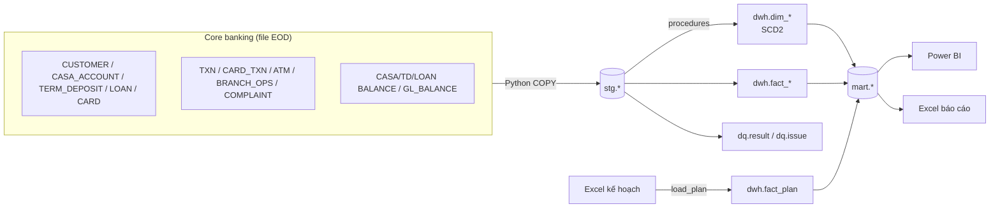

# Khám phá dữ liệu bằng SQL

Tài liệu này giúp bạn mở database, hiểu mô hình dữ liệu và chạy bộ truy vấn khám phá trong `sql/06_exploration/` trước khi làm dashboard.

## 1. Mở công cụ truy vấn

**Cách A: pgAdmin 4** (cài sẵn cùng PostgreSQL)

1. Mở pgAdmin → nhập master password (nếu hỏi).
2. Cây bên trái: *Servers → PostgreSQL 17* → nhập mật khẩu `postgres`.
3. Mở *Databases → dlb_dwh*, chuột phải → **Query Tool**.
4. Bấm biểu tượng thư mục (Open File) → chọn `sql/06_exploration/00_lam_quen.sql`.
5. Bôi đen một câu truy vấn → **F5** để chạy. Kết quả hiện ở khung *Data Output* bên dưới.

**Cách B: VS Code / Antigravity** (viết SQL cùng chỗ với code Python)

1. Cài extension **PostgreSQL** (của Microsoft) hoặc **SQLTools** + **SQLTools PostgreSQL Driver**.
2. Tạo kết nối: host `localhost`, port `5432`, database `dlb_dwh`, user `postgres`, mật khẩu của bạn.
3. Mở file `.sql` → bôi đen câu truy vấn → chạy (Ctrl+Shift+E với extension Microsoft, Ctrl+E Ctrl+E với SQLTools).

> Chưa có database? Chạy các bước 0–4 trong [05_runbook.md](05_runbook.md) trước.

## 2. Mô hình dữ liệu

**Mô hình sao** trong `dwh`:

- **Dimension** (trả lời "ai, ở đâu, cái gì, khi nào"): `dim_date`, `dim_branch`, `dim_customer`, `dim_product`, `dim_channel`, `dim_loan_group`, `dim_mcc`, cùng các hợp đồng `dim_casa_account`, `dim_term_deposit`, `dim_loan`, `dim_card`.
- **Fact** (các con số):
  - *giao dịch*: `fact_casa_txn`, `fact_card_txn`
  - *số dư cuối tháng*: `fact_casa_balance`, `fact_td_balance`, `fact_loan_balance`, `fact_gl_balance`
  - *vận hành*: `fact_atm_daily`, `fact_branch_ops`, `fact_complaint`
  - *kế hoạch*: `fact_plan`

**Mart** (`mart`) là bảng tổng hợp sẵn, Power BI chủ yếu dùng tầng này:

| Mart | Độ chi tiết (grain) | Dùng cho trang dashboard |
|---|---|---|
| `kpi_branch_month` | chi nhánh × tháng | Tổng quan, Huy động, Tín dụng, Kế hoạch |
| `deposit_daily` | ngày × chi nhánh × sản phẩm | Huy động theo ngày (T-1) |
| `loan_migration` | tháng × sản phẩm × nhóm đầu → nhóm cuối | Rủi ro tín dụng |
| `channel_month` | tháng × chi nhánh × kênh × loại GD | Kênh số |
| `card_spend_month` | tháng × loại thẻ × nhóm MCC | Thẻ |
| `customer_month` | tháng × chi nhánh × phân khúc | Khách hàng |
| `v_dq_summary` | lô × quy tắc | Chất lượng dữ liệu |

## 3. Lộ trình khám phá (khoảng 1–2 giờ)

1. `00_lam_quen.sql`: dữ liệu nằm ở đâu, ETL chạy thế nào.
2. `01_danh_muc.sql`: mạng lưới, khách hàng, **SCD2** (chi nhánh đổi tỉnh sau sáp nhập).
3. `02_huy_dong.sql`: CASA, chạy số cuối quý, lãi suất, thang đáo hạn.
4. `03_tin_dung.sql`: nợ xấu, **ma trận chuyển nhóm nợ**, sự kiện Cần Thơ.
5. `04_giao_dich_the.sql`: dịch chuyển kênh số, Tết, chiến dịch thẻ.
6. `05_van_hanh.sql`: sự cố ATM, thời gian chờ, khiếu nại.
7. `06_ke_hoach_chat_luong.sql`: thực hiện vs kế hoạch, chất lượng dữ liệu.

Khi chạy, ghi lại 3–5 phát hiện thú vị nhất. Chúng sẽ thành "câu chuyện" của dashboard.

## 4. Các câu chuyện có sẵn trong dữ liệu

| Câu chuyện | Truy vấn kiểm chứng |
|---|---|
| Huy động vượt kế hoạch, tín dụng hụt kế hoạch | Q6.1 |
| Cụm Cần Thơ: nợ xấu 8,7% (09/2025), đứng cuối về hoàn thành kế hoạch dư nợ | Q3.3, Q6.2 |
| Chiến dịch thẻ Q2/2025: phát hành gấp 3, kích hoạt chỉ 33–46% | Q4.6 |
| Tết: rút tiền ATM tăng gấp 3 trước Tết, gần như ngừng trong kỳ nghỉ | Q4.2 |
| Doanh nghiệp "chạy số" CASA ngày cuối quý rồi rút ra đầu quý | Q2.2 |
| Sự cố ATM cụm CN Sài Gòn 9–10/2025 | Q5.1 |
| Lỗi app 03/2026: khiếu nại tăng gần 10 lần | Q5.6 |
| Kênh số tăng dần, giao dịch tại quầy giảm | Q4.1 |
