# Power BI: mô hình dữ liệu và dashboard

File: `powerbi/DLB_Operations_Dashboard.pbip`, định dạng **Power BI Project (PBIP)**. Model lưu dạng TMDL, báo cáo lưu dạng PBIR (JSON). Toàn bộ đều là file văn bản nên Git so sánh được từng thay đổi.

```
powerbi/
├── DLB_Operations_Dashboard.pbip                 # file mở bằng Power BI Desktop
├── DLB_Operations_Dashboard.SemanticModel/       # model: bảng, quan hệ, measure (TMDL)
│   └── definition/tables/_Measures.tmdl          # toàn bộ DAX measure
├── DLB_Operations_Dashboard.Report/              # 6 trang báo cáo (PBIR JSON) + theme DLB
└── build_report.py                               # script dựng bố cục ban đầu (xem mục 7)
```

---

## 1. Luồng dữ liệu

```
PostgreSQL dlb_dwh
  mart.*  ──▶  rpt.* (14 view, sql/05_reports/02_powerbi_views.sql)  ──Import──▶  Power BI model  ──▶  6 trang
```

- Power BI **chỉ đọc schema `rpt`**, không đọc thẳng `dwh` hay `mart`. Nhờ vậy DWH có thể đổi cấu trúc mà báo cáo không vỡ; chỉ cần sửa view.
- Chế độ **Import**: dữ liệu nạp vào bộ nhớ, nên truy vấn nhanh. Muốn cập nhật số mới thì bấm Refresh sau khi chạy lô ETL.
- Kết nối dùng 2 tham số Power Query: `PgServer` (mặc định `localhost`) và `PgDatabase` (`dlb_dwh`). Đổi máy chủ ở **Transform data → Edit parameters**, không cần sửa từng bảng.
- Mỗi bảng lấy dữ liệu bằng điều hướng `Source{[Schema="rpt",Item="..."]}` thay vì câu SQL tự viết. Cách này tránh được hộp thoại xin quyền chạy truy vấn native mỗi lần refresh.

---

## 2. Các bảng

Mô hình hình sao (star schema): 3 bảng dimension dùng chung và 11 bảng fact.

| Bảng | Nguồn (`rpt.`) | Độ chi tiết (1 dòng =) | Số dòng |
|---|---|---|---|
| **DimDate** | `dim_date` | 1 ngày, 01/12/2023–31/08/2026; **đã đánh dấu Date table** | 1.005 |
| **DimBranch** | `dim_branch` | 1 chi nhánh/PGD, kèm chi nhánh quản lý, tỉnh, vùng | 40 |
| **DimProduct** | `dim_product` | 1 sản phẩm | 19 |
| FactKPI | `fact_kpi_branch_month` | 1 đơn vị × 1 tháng: số dư, phát sinh, kế hoạch | 1.320 |
| FactDepositDaily | `fact_deposit_daily` | 1 ngày × đơn vị × sản phẩm tiền gửi | 239.579 |
| FactLoanPortfolio | `fact_loan_portfolio` | 1 ngày chụp × đơn vị × sản phẩm × nhóm nợ | 14.680 |
| FactLoanMigration | `fact_loan_migration` | 1 tháng × sản phẩm × (nhóm đầu kỳ → nhóm cuối kỳ) | 2.346 |
| FactChannel | `fact_channel_month` | 1 tháng × đơn vị × kênh × loại giao dịch × loại KH | 33.307 |
| FactCardSpend | `fact_card_spend_month` | 1 tháng × sản phẩm thẻ × ngành hàng (MCC) | 766 |
| FactCardCohort | `fact_card_cohort` | 1 tháng phát hành × sản phẩm × đơn vị | 1.267 |
| FactATM | `fact_atm_daily` | 1 ATM × 1 ngày | 59.414 |
| FactComplaint | `fact_complaint` | 1 khiếu nại | 3.145 |
| FactBranchOps | `fact_branch_ops` | 1 đơn vị × 1 ngày làm việc | 26.520 |
| FactDQ | `fact_dq` | 1 lô × 1 quy tắc DQ | 728 |
| _Measures | (bảng rỗng) | chỉ chứa measure | |

Số dòng ở trên đã được đối chiếu khớp 100% với PostgreSQL sau khi refresh.

**Cột hiển thị trong DimDate:**
- `Tháng` (T08/2026) và `Tháng (ngắn)` (8/26) đều sắp xếp theo `year_month_key`.
- `Cuối tháng`, `Quý`, `Năm`, `Thứ`.

---

## 3. Quan hệ

24 quan hệ, tất cả là **nhiều–một, lọc một chiều** từ dimension sang fact.

```mermaid
erDiagram
    DimDate ||--o{ FactKPI : "month_end"
    DimDate ||--o{ FactDepositDaily : "balance_date"
    DimDate ||--o{ FactLoanPortfolio : "snapshot_date"
    DimDate ||--o{ FactLoanMigration : "month_end"
    DimDate ||--o{ FactChannel : "month_end"
    DimDate ||--o{ FactCardSpend : "month_end"
    DimDate ||--o{ FactCardCohort : "issue_month"
    DimDate ||--o{ FactATM : "report_date"
    DimDate ||--o{ FactComplaint : "received_date"
    DimDate ||--o{ FactBranchOps : "business_date"
    DimDate ||--o{ FactDQ : "business_date"
    DimBranch ||--o{ FactKPI : "branch_code"
    DimBranch ||--o{ FactDepositDaily : "branch_code"
    DimBranch ||--o{ FactLoanPortfolio : "branch_code"
    DimBranch ||--o{ FactChannel : "branch_code"
    DimBranch ||--o{ FactCardCohort : "branch_code"
    DimBranch ||--o{ FactATM : "branch_code"
    DimBranch ||--o{ FactComplaint : "branch_code"
    DimBranch ||--o{ FactBranchOps : "branch_code"
    DimProduct ||--o{ FactDepositDaily : "product_code"
    DimProduct ||--o{ FactLoanPortfolio : "product_code"
    DimProduct ||--o{ FactLoanMigration : "product_code"
    DimProduct ||--o{ FactCardSpend : "product_code"
    DimProduct ||--o{ FactCardCohort : "product_code"
```



Một số bảng không nối với DimBranch vì dữ liệu gốc không có chi nhánh: FactLoanMigration, FactCardSpend, FactDQ. Vì vậy, lọc theo Chi nhánh **không** ảnh hưởng tới ma trận chuyển nhóm, chi tiêu thẻ theo ngành và trang Chất lượng dữ liệu. Trang 6 chỉ có bộ lọc Năm vì lý do này.

---

## 4. Measure DAX

Có 77 measure, nằm trong bảng `_Measures` và chia theo thư mục:

| Thư mục | Nội dung |
|---|---|
| `0. Chung` | Ngày dữ liệu, cửa sổ 13/18 tháng |
| `1. Huy động` | Tổng huy động, CASA, tiền gửi có kỳ hạn, kế hoạch, YTD, YoY, cùng kỳ |
| `2. Tín dụng & rủi ro` | Dư nợ, nợ nhóm 2, nợ xấu, dự phòng, bao phủ, LDR, giải ngân, chuyển nhóm |
| `3. Khách hàng, thẻ & kênh` | Khách hàng mới / YTD, thẻ phát hành / kích hoạt, chi tiêu thẻ, tỷ trọng kênh số |
| `4. Vận hành` | Uptime ATM, sự cố, rút tiền, khiếu nại, SLA, thời gian xử lý, thời gian chờ |
| `5. Chất lượng dữ liệu` | Bản ghi kiểm tra / lỗi, lô FAIL, tỷ lệ lỗi |
| `9. Nhãn thẻ KPI` | Dòng chữ so sánh dưới mỗi thẻ KPI |

### 4.1 Số dư cuối kỳ (snapshot)

Số dư không được cộng qua các tháng. Measure tìm ngày cuối cùng có dữ liệu trong phạm vi lọc, rồi lấy số dư đúng ngày đó:

```dax
Tổng huy động =
VAR _m = MAX ( FactKPI[month_end] )                 -- ngày cuối tháng mới nhất trong phạm vi lọc
RETURN
    DIVIDE (
        CALCULATE ( SUM ( FactKPI[deposit_balance] ),
                    REMOVEFILTERS ( DimDate ),      -- bỏ lọc ngày của biểu đồ / slicer
                    DimDate[Ngày] = _m ),           -- chỉ giữ đúng ngày chốt
        1e9 )                                       -- đổi ra tỷ đồng
```

- Chọn Năm = 2025: `_m` = 31/12/2025, cho ra số dư cuối năm.
- Trên biểu đồ theo tháng: mỗi điểm là số dư cuối tháng đó.
- Lọc theo chi nhánh vẫn có tác dụng, vì `REMOVEFILTERS` chỉ bỏ lọc trên DimDate.

Các measure dùng cùng cách này: CASA, Tiền gửi có kỳ hạn, Kế hoạch huy động, Dư nợ, Nợ nhóm 2, Nợ xấu, Dự phòng rủi ro, Kế hoạch dư nợ, Khách hàng hoạt động. Hai measure dùng bảng khác nhưng cùng kiểu: Dư nợ (danh mục) và Số dư huy động ngày.

### 4.2 So sánh theo thời gian

```dax
Huy động đầu năm =
VAR _m = MAX ( FactKPI[month_end] )
RETURN DIVIDE ( CALCULATE ( SUM ( FactKPI[deposit_balance] ), REMOVEFILTERS ( DimDate ),
                            DimDate[Ngày] = DATE ( YEAR ( _m ) - 1, 12, 31 ) ), 1e9 )

Tăng trưởng huy động YTD = DIVIDE ( [Tổng huy động] - [Huy động đầu năm], [Huy động đầu năm] )
```

- **Cùng kỳ (YoY):** thay ngày chốt bằng `EOMONTH ( _m, -12 )`.
- **Chỉ số phát sinh lũy kế từ đầu năm**, ví dụ `Khách hàng mới YTD`: dùng `DATESBETWEEN ( DimDate[Ngày], DATE ( YEAR ( _m ), 1, 1 ), _m )`.

Dự án chủ động không dùng `TOTALYTD` hay `SAMEPERIODLASTYEAR`. Dữ liệu là số dư cuối tháng, nên chỉ định rõ ngày chốt thì dễ kiểm soát và dễ giải thích hơn.

### 4.3 Tỷ lệ

Tỷ lệ luôn tính bằng `DIVIDE` trên hai measure đã tổng hợp, không lấy trung bình các tỷ lệ của chi nhánh:

```dax
Tỷ lệ nợ xấu = DIVIDE ( [Nợ xấu], [Dư nợ] )
Tỷ lệ bao phủ nợ xấu = DIVIDE ( [Dự phòng rủi ro], [Nợ xấu] )
Thời gian chờ TB (phút) =            -- bình quân gia quyền theo số lượt phục vụ
DIVIDE ( SUMX ( FactBranchOps, FactBranchOps[avg_wait_minutes]
                * ( FactBranchOps[counter_txn_count] + FactBranchOps[service_request_count] ) ),
         SUM ( FactBranchOps[counter_txn_count] ) + SUM ( FactBranchOps[service_request_count] ) )
```

### 4.4 Cửa sổ 13 tháng cho biểu đồ xu hướng

Để trục thời gian không quá dày, các biểu đồ theo tháng có **visual filter** `Hiển thị 13 tháng = 1`:

```dax
Hiển thị 13 tháng =
VAR _last = CALCULATE ( MAX ( DimDate[Ngày] ), ALLSELECTED ( DimDate ) )   -- ngày cuối trong slicer/page filter
VAR _cur  = MAX ( DimDate[Ngày] )                                          -- tháng đang vẽ
RETURN IF ( _cur > EOMONTH ( _last, -13 ) && _cur <= EOMONTH ( _last, 0 ), 1, 0 )
```

- Không chọn năm: hiển thị 08/2025–08/2026.
- Chọn Năm = 2025: hiển thị đủ 12 tháng của năm 2025.
- Biểu đồ chiến dịch thẻ dùng `Hiển thị 18 tháng` để vẫn thấy quý 2/2025.

Mỗi trang còn có **page filter** `Năm ≥ 2024`, vì tháng 12/2023 chỉ là số dư đầu kỳ khi chuyển đổi dữ liệu.

### 4.5 Nhãn so sánh trên thẻ KPI

Dòng chữ nhỏ dưới mỗi thẻ là measure dạng văn bản, ví dụ:

```dax
Nhãn · Tổng huy động =
"YTD " & FORMAT ( [Tăng trưởng huy động YTD], "+0.0%;-0.0%" ) & " · "
       & FORMAT ( [% HT KH huy động], "0%" ) & " kế hoạch"
-- 31/08/2026 → "YTD +6.5% · 103% kế hoạch"
```

### 4.6 Định dạng và đơn vị

Đơn vị được gắn thẳng vào format string của measure, nên thẻ, bảng và trục biểu đồ đều hiển thị thống nhất:

| Loại | Format string | Hiển thị |
|---|---|---|
| Tiền (đã chia 1e9 trong measure) | `#,##0.0 "tỷ"` | 2,168.7 tỷ |
| Tỷ lệ | `0.0%` / `0.00%` (nợ xấu) | 33.0% / 1.43% |
| Khách hàng / thẻ / khiếu nại | `#,##0 "KH"` / `"thẻ"` / `"vụ"` | 1,051 KH |
| Thời gian | `0.0 "phút"` / `0.0 "ngày"` | 4.2 phút |

Tiền được chia 1e9 ngay trong measure, không dùng display units của visual. Lý do: format kiểu Excel `#,##0,,,` không được Power BI hỗ trợ đầy đủ (từng hiển thị lỗi "2.2,,,T,").

---

## 5. Các trang báo cáo

Khung chung của mọi trang: thanh bên trái (tên ngân hàng, bộ lọc Năm / Vùng / Chi nhánh, ngày dữ liệu, ghi chú đơn vị), tiêu đề trang, 4–6 thẻ KPI, và 4–5 biểu đồ.

| Trang | Thẻ KPI | Biểu đồ chính |
|---|---|---|
| 1. Tổng quan | Tổng huy động, Dư nợ, CASA, Nợ xấu, LDR, KH mới (YTD) | Huy động & dư nợ theo tháng; nợ xấu & nợ nhóm 2; bảng kết quả theo chi nhánh; KH mới so với kế hoạch |
| 2. Huy động | Tổng huy động, CASA, Có kỳ hạn, Tỷ lệ CASA, Tăng trưởng YoY, % KH | Cơ cấu huy động; tỷ lệ CASA (chạy số cuối quý); số dư theo ngày; bảng theo chi nhánh |
| 3. Tín dụng & Rủi ro | Dư nợ, TT tín dụng YTD, Nợ xấu, Tỷ lệ nợ xấu, Nhóm 2, Bao phủ | Nợ xấu theo chi nhánh / sản phẩm; dư nợ theo sản phẩm; ma trận chuyển nhóm; giải ngân mới |
| 4. Khách hàng, Thẻ & Kênh | KH hoạt động, KH mới, Kênh số, Thẻ phát hành, Kích hoạt, Chi tiêu | Cơ cấu giao dịch theo kênh; chiến dịch thẻ; chi tiêu theo ngành hàng; tỷ trọng kênh số |
| 5. Vận hành | Uptime, Sự cố ATM, Khiếu nại, SLA, Xử lý TB, Chờ TB | Uptime theo tháng; rút tiền ATM; khiếu nại theo tháng / loại; thời gian chờ theo chi nhánh |
| 6. Chất lượng dữ liệu | Bản ghi kiểm tra, Lỗi, Tỷ lệ lỗi, Lô FAIL | Bảng 15 quy tắc; lỗi theo chiều chất lượng; lỗi theo tháng |

Ảnh chụp từng trang: `docs/images/`. Cách đọc từng biểu đồ và các câu chuyện nghiệp vụ: [00_business_context.md](00_business_context.md).

---

## 6. Mở và làm mới dữ liệu

1. Chạy xong pipeline ETL và tạo view báo cáo:
   ```
   python -m python.etl.run_sql sql/05_reports/02_powerbi_views.sql
   ```
2. Mở `powerbi/DLB_Operations_Dashboard.pbip`. Nếu PostgreSQL không ở `localhost`: **Transform data → Edit parameters**.
3. Bấm **Refresh**. Lần đầu, Power BI hỏi thông tin đăng nhập PostgreSQL (Database, user/password của bạn).
4. Kiểm tra nhanh: trang 1 phải ra Tổng huy động **2,168.7 tỷ**, Dư nợ **1,632.2 tỷ**, CASA **33.0%**, Nợ xấu **1.43%**, trùng với `logs/health_check.txt`.

**Lỗi thường gặp:**

| Lỗi | Nguyên nhân | Cách xử lý |
|---|---|---|
| `The key didn't match any rows in the table` | Chưa tạo schema `rpt`, hoặc Power BI còn giữ danh sách bảng cũ | Chạy bước 1, sau đó đóng hẳn Power BI rồi mở lại |
| Hộp thoại "Native Database Query" | Có truy vấn SQL viết tay | Model hiện tại không dùng; nếu tự thêm, bấm Run |
| Số liệu trống sau khi mở | File cache dữ liệu (`.pbi/cache.abf`) không đưa lên Git | Bấm Refresh |

---

## 7. Ghi chú về `build_report.py`

Script này dựng **bố cục ban đầu** của 6 trang (vị trí, loại biểu đồ, theme DLB, filter) bằng cách ghi thẳng file PBIR. Sau đó bố cục đã được chỉnh tay trong Power BI Desktop.

> **Không chạy lại script trên báo cáo hiện tại.** Script xóa và viết lại toàn bộ thư mục `pages/`, nên mọi chỉnh sửa tay sẽ mất. File `.pbip` hiện tại là bản chuẩn. Script chỉ được giữ lại để minh họa cách tạo báo cáo Power BI bằng code (report-as-code).

Để tránh chạy nhầm, script chỉ thực thi khi có cờ `--force`. Nếu cần dựng lại từ đầu: đóng Power BI, chạy `python powerbi/build_report.py --force`, rồi mở lại `.pbip`.
